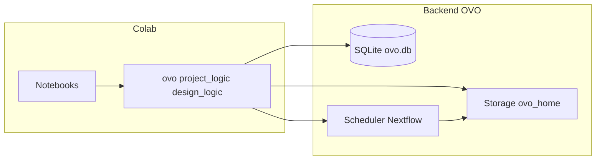

# Plan: Reproducir 361 diseños con backend OVO y nuevo proyecto

## Contexto

- Las **361 predicciones** del paper están guardadas en la BD OVO (proyecto "OVO Publication Examples 1"); los inputs son 1A4I (oxidoreductasa), 5IUS (PD-1), 4ZXB/6PXV (receptor insulina), ya descargados en [ovo_home/inputs](d:/ProyectosUniversidad/BioInformatica/ovo_home/inputs) (oxidoreductase, pd1, insulin).
- Objetivo: **reproducir los workflows** (no solo visualizar) usando la API de OVO desde Colabs; y **crear un nuevo proyecto** en OVO para organizar este trabajo.

## Cómo OVO maneja varios proyectos

- Proyectos y rondas se crean por API (no solo por la app):
  - [ovo/ovo/core/logic/project_logic.py](d:/ProyectosUniversidad/BioInformatica/ovo/ovo/core/logic/project_logic.py): `get_or_create_project(project_name)`, `get_or_create_project_round(project_name, round_name)`.
  - Si el proyecto no existe, se crea y se devuelve; si existe, se devuelve el mismo. Igual para la ronda.
- Cada envío de workflow crea un **Pool** y un **DesignJob** en la ronda elegida:
  - [ovo/ovo/core/logic/design_logic.py](d:/ProyectosUniversidad/BioInformatica/ovo/ovo/core/logic/design_logic.py): `submit_design_workflow(workflow, scheduler_key, round_id, pool_name, pool_description)`.
- Los paths de entrada (PDB) se pasan en el workflow; Storage los copia al workdir del scheduler vía [ovo/ovo/core/storage.py](d:/ProyectosUniversidad/BioInformatica/ovo/ovo/core/storage.py) `prepare_workflow_input(s)`. Se admiten rutas absolutas o relativas al `storage_root` (habitualmente ovo_home).

## Pasos del plan

### 1. Nuevo proyecto OVO desde notebook

- En un notebook (ej. primer Colab del nuevo flujo):
  - Fijar `OVO_HOME` al `ovo_home` de la tesis (en Colab: ruta en Drive).
  - Importar `from ovo.core.logic import project_logic` y opcionalmente `round_logic`.
  - Llamar `project, round_obj = project_logic.get_or_create_project_round("Tesis 361 replicacion", "Round 1")` (o el nombre que elijas).
  - Usar `round_obj.id` en todos los `submit_design_workflow(..., round_id=round_obj.id, ...)`.
- Tener en cuenta: `get_username()` se usa como autor; en Colab conviene definir `USER` o la variable que use [ovo/ovo/core/auth.py](d:/ProyectosUniversidad/BioInformatica/ovo/ovo/core/auth.py) para que el autor quede identificado.

### 2. Rutas a los PDBs en ovo_home/inputs

- Construir rutas absolutas a partir de `OVO_HOME` para que funcionen en Colab y local:
  - Scaffold oxidoreductasa: `{OVO_HOME}/inputs/oxidoreductase/1A4I.pdb`
  - Scaffold PD-1: `{OVO_HOME}/inputs/pd1/5IUS.pdb`
  - Binder insulina: `{OVO_HOME}/inputs/insulin/4ZXB.pdb` o `6PXV.pdb`
- Pasar estas rutas en `RFdiffusionParams(input_pdb_paths=[...])` (o una sola para un único contig). Storage acepta rutas absolutas en [storage.resolve_path](d:/ProyectosUniversidad/BioInformatica/ovo/ovo/core/storage.py).

### 3. Notebooks que envían workflows (reproducir 361)

- **Scaffold 1A4I (oxidoreductasa):** Construir `RFdiffusionScaffoldDesignWorkflow` con:
  - `rfdiffusion_params`: input_pdb_paths, contigs (ej. `10-35/A56-56/10-35/A100-100/10-35/A125-125/10-35`), num_designs, timesteps, model_weights (ActiveSite para ~13 aceptados).
  - `protein_mpnn_params`, `refolding_params` (primary_test af2_model_1_ptm_ft_3rec).
  - Referencia de parámetros: [tests/integration_tests/test_full_rfdiffusion_scaffold_design_workflow.py](d:/ProyectosUniversidad/BioInformatica/ovo/tests/integration_tests/test_full_rfdiffusion_scaffold_design_workflow.py) y tabla jobs en los CSVs del 01 (contigs, num_designs, thresholds).
- **Scaffold 5IUS (PD-1):** Mismo tipo de workflow; contigs para segmentos 63-82 y 119-140; opción de inpainting si se quiere replicar pool xeh.
- **Binder 4ZXB/6PXV:** Construir `RFdiffusionBinderDesignWorkflow` con target chain, trim (ej. E6-155), hotspots (E64,E88,E96), binder_length, contig (ej. `E6-155/0 50-100`), y refolding multimer.
- En todos los casos: `design_logic.submit_design_workflow(workflow, scheduler_key, round_id, pool_name, pool_description)` con el `round_id` del nuevo proyecto.
- Tras el run: `design_logic.process_results(design_job)` para ingestar resultados en Storage y en la BD (Designs + DescriptorValues).

### 4. Scheduler y entorno de ejecución

- Los workflows se ejecutan con **Nextflow** (no disponible en Windows; en Colab el kernel suele ser Linux). El `scheduler_key` debe ser uno configurado en `ovo_home/config.yml` (ej. `local_conda`, o un perfil remoto).
- Para que “todo se complete en los Colabs”: si el scheduler es local (misma máquina que el kernel), Colab debe tener OVO + Nextflow + dependencias (conda/singularity) en ese entorno, o el notebook debe conectarse a un backend que ya tenga el scheduler (mismo OVO_HOME en Drive y scheduler corriendo en un servidor qu