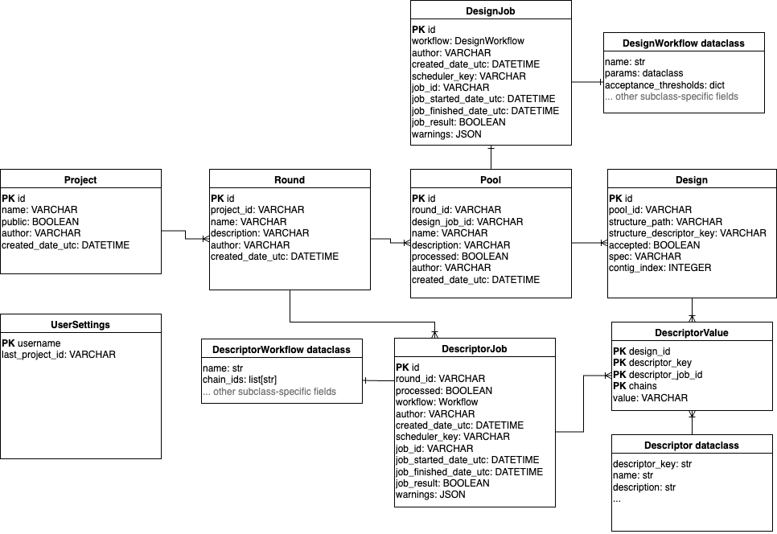

# OVO Database

## Data model



In the OVO data model, a `Design` corresponds to one designed molecule defined by its sequence. 
`Designs` are organized into `Pools`, where each `Pool` is created by a single submitted workflow 
or uploaded by the user. 
Submission parameters and job status metadata are stored in a separate `DesignJob` model 
using a workflow field storing a JSON-serialized instance of a `DesignWorkflow` dataclass. 
The `DesignWorkflow` dataclasses define workflow parameters and encapsulate use-case-specific logic. 
New use-cases can be added by OVO plugins that implement their own `DesignWorkflow` subclasses.

Each `Pool` is identified by a randomly generated three-letter code (such as `qki`) that is
unique within the current database instance. This ID is used as a prefix for the ID of each `Design` 
along with the backbone and sequence identifier (such as `ovo_qki_0045_cycle01`), ensuring that each
design can be uniquely tracked to its job of origin (and the corresponding workflow parameters). 
`Pools` can be grouped into `Rounds`, corresponding to the iterative design-make-test-analyze loop, 
and further into `Projects`, enabling sustainable organization in a multi-user setting. 

Each design can be annotated with descriptors using the `DescriptorValue` model, which 
is a key-value "tall" representation where all descriptor values are stored in a single
`value` column and associated with the descriptor using a `descriptor_key` column 
(as opposed to a "wide" representation which would use a separate column for each descriptor). 
Each `DescriptorValue` row is a single value associated with a single `descriptor_key`, 
`Design` and `DescriptorJob`, storing workflow parameters in a `DescriptorWorkflow` dataclass, analogous to design jobs. 
Different types of Descriptors (such as AlphaFold2 pLDDT, Rosetta ddG, or total positive patch area) 
are uniquely defined by their `descriptor_key` and provide additional metadata such as their 
human-readable name and description. The `Descriptor` type objects are not defined in the database 
but inside OVO codebase and extended by plugins. Protein structures and other files are not stored 
directly in the database but referenced by their storage path as managed by the `Storage` class. 
The structure path string can be stored as a field of the `Design` model or as a special type of `Descriptor`. 

## Interacting with the database

Database rows can be retrieved from the database using the `db` object using `select` and `get` methods:

```python
from ovo import db

# List all projects
db.Project.select()
# [Project(author='username', created_date_utc=datetime.datetime(2025, 11, 13, 9, 58, 36, 339174), id='b8e657bb-b0b0-423e-9235-383a6d8f74e5', name='OVO Publication Examples 1', public=True)]

# Get project by name
project = db.Project.get(name="OVO Publication Examples 1")
print(project.id)
# b8e657bb-b0b0-423e-9235-383a6d8f74e5

# Get Pool object
pool = db.Pool.get(id="qki")
print(pool.id)
print(pool.name)
# qki
# My first design pool

# Get list of Design objects in the pool
all_designs = db.Design.select(pool_id="qki")
print(all_designs[0].id)
# 'ovo_qki_0001_cycle01'

# Get only accepted designs
accepted_designs = db.Design.select(pool_id="qki", accepted=True)
print(accepted_designs[0].id)
# 'ovo_qki_0125_cycle02'
```

Use the `project_logic` module to retrieve projects, rounds and pools:

```python
from ovo import db, project_logic

project, round = project_logic.get_or_create_project_round(
    "OVO Publication Examples 1",
    "Round 1",
)
print(round.id)
```

Use the `design_logic` module for convenience functions to retrieve designs and pools:

```python
from ovo import db, design_logic

project = db.Project.get(name="OVO Publication Examples 1")
pools = design_logic.get_pools_table(project_id=project.id)
pools.head()
#                    Round   ID                                          Name  ...
# 0          Binder design  bbc  4ZXB 1000 designs default weights ligandmpnn  ...
# 1          Binder design  qki                   Top designs diversification  ...
# 2      Motif scaffolding  jov          1A41 6*100*8 designs default weights  ...
# 3  Interface scaffolding  zuk              5IUS 500*5 designs PD1 interface  ...
# 4          Binder design  mmo                  4ZXB 1000 designs beta sheet  ...
```

Use the `descriptor_logic` module for convenience functions to retrieve descriptor values:

```python
from ovo import db, descriptor_logic

# Get designs as a pandas DataFrame
designs = db.Design.select_dataframe(pool_id="qki", accepted=True)
designs.head()
#                      pool_id                                     structure_path  ...  
# id                                                                               ...  
# ovo_qki_0045_cycle01     qki  project/fd3f1fcc-1dda-4076-ad4e-7b885ec90032/p...  ...  
# ovo_qki_0045_cycle02     qki  project/fd3f1fcc-1dda-4076-ad4e-7b885ec90032/p...  ...  
# ovo_qki_0045_cycle04     qki  project/fd3f1fcc-1dda-4076-ad4e-7b885ec90032/p...  ...  
# ovo_qki_0126_cycle01     qki  project/fd3f1fcc-1dda-4076-ad4e-7b885ec90032/p...  ...  
# ovo_qki_0193_cycle01     qki  project/fd3f1fcc-1dda-4076-ad4e-7b885ec90032/p...  ...  

# Get wide descriptor table for the designs
values = descriptor_logic.get_wide_descriptor_table(design_ids=designs.index)
values = designs.join(values) # join with metadata from designs table
values.head()
#                      pool_id  ... Radius of gyration  Rosetta ddG
# id                            ...                                
# ovo_qki_0045_cycle01     qki  ...          75.842162   -47.569473
# ovo_qki_0045_cycle02     qki  ...          75.842162   -46.606552
# ovo_qki_0045_cycle04     qki  ...          75.842162   -48.614517
# ovo_qki_0126_cycle01     qki  ...          65.733242   -33.502827
# ovo_qki_0193_cycle01     qki  ...          51.979126   -20.721975

# Show available descriptors
print(values.columns.tolist())
# ['pool_id', 'structure_path', 'structure_descriptor_key', 'accepted', 'spec', 'contig_index', 'Sequence A', 'AF2 iPAE', ...]

# Paths to PDB files are also stored as descriptors:
paths = values[[
    "RFdiffusion backbone design",
    "ProteinMPNN FastRelax sequence design",
    "AlphaFold2 Initial Guess prediction"
]]
paths.head()
#                                             RFdiffusion backbone design  ...
# id                                                                                                                                                                            
# ovo_qki_01_01_cycle01  project/b8e657bb-b0b0-423e-9235-383a6d8f74e5/p ...
# ovo_qki_01_11_cycle02  project/b8e657bb-b0b0-423e-9235-383a6d8f74e5/p ...
# ovo_qki_01_14_cycle01  project/b8e657bb-b0b0-423e-9235-383a6d8f74e5/p ...
# ovo_qki_01_15_cycle02  project/b8e657bb-b0b0-423e-9235-383a6d8f74e5/p ...
# ovo_qki_01_21_cycle03  project/b8e657bb-b0b0-423e-9235-383a6d8f74e5/p ...
# ovo_qki_01_23_cycle02  project/b8e657bb-b0b0-423e-9235-383a6d8f74e5/p ...
```

See [Jupyter notebooks examples](https://github.com/MSDLLCpapers/ovo-examples/tree/main/jupyter_notebooks_example/notebooks)
for more detailed examples of interacting with the database.
