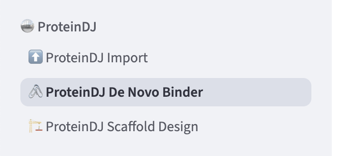

# OVO ProteinDJ Plugin

```
    ██████╗ ██████╗  ██████╗ ████████╗███████╗██╗███╗   ██╗██████╗      ██╗
    ██╔══██╗██╔══██╗██╔═══██╗╚══██╔══╝██╔════╝██║████╗  ██║██╔══██╗     ██║
    ██████╔╝██████╔╝██║   ██║   ██║   █████╗  ██║██╔██╗ ██║██║  ██║     ██║
    ██╔═══╝ ██╔══██╗██║   ██║   ██║   ██╔══╝  ██║██║╚██╗██║██║  ██║██   ██║
    ██║     ██║  ██║╚██████╔╝   ██║   ███████╗██║██║ ╚████║██████╔╝╚█████╔╝
    ╚═╝     ╚═╝  ╚═╝ ╚═════╝    ╚═╝   ╚══════╝╚═╝╚═╝  ╚═══╝╚═════╝  ╚════╝ 
                       ProteinDJ Protein Design Pipeline                   
              Developers: Dylan Silke, Josh Hardy, Julie Iskander       
                   https://github.com/PapenfussLab/proteindj   
```

[ProteinDJ](https://github.com/PapenfussLab/proteindj) is a Nextflow pipeline for protein design, 
incorporating the RFdiffusion + ProteinMPNN + AlphaFold2 workflow as well as other design methods.

## Features

- Importing existing ProteinDJ result folders to enable visualizing structure alignments and descriptors
- Running the motif scaffolding and binder design workflows from the UI

## Installation

First install the plugin into your OVO Python environment:

```
pip install git+https://github.com/MSDLLCpapers/ovo-proteindj
```

Then add the following block to your OVO `config.yml`:

```yaml
plugins:
  ovo_proteindj:
    default_params:
      rfd_models: "{config.reference_files_dir}/rfdiffusion_models"
      af2_models: "{config.reference_files_dir}/alphafold_models"
      boltz_models: "{config.reference_files_dir}/boltz_models"
      cpus: 4
      cpus_per_gpu: 4
      memory_gpu: 14GB
      memory_cpu: 14GB
      gpu_queue: gpu-small
      gpu_model: a10g
```

Now you should see a ProteinDJ block when running `ovo app`:


