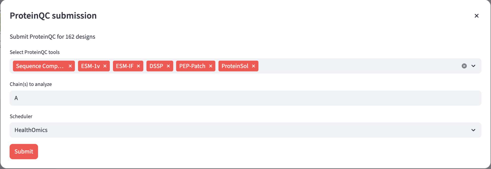

# ProteinQC Quickstart

## 1. Prerequisites

Before you proceed, make sure to install OVO and set up the OVO home directory
by following [OVO Installation](../user_guide/installation.md).

You will need approximately 52 GB (for conda) or 80 GB (for Singularity) of free disk space to initialize all ProteinQC tools:

- ESM-IF model weights: 2 GB
- ESM-1v model weights: 40 GB
- Execution environments 
  - Conda environments: 10 GB (on MacOS)
  - or containers when using Singularity/Apptainer/Docker: 38 GB for Singularity

## 2. Set up ProteinQC

Next, set up ProteinQC by running:

```bash
# Set up all ProteinQC tools
ovo init proteinqc

# Or set up specific ProteinQC tools only
ovo init proteinqc --tools seq_composition,esm_if,dssp,proteinsol
```

When working with multiple schedulers as described in [Schedulers](../user_guide/schedulers.md),
make sure to specify the target scheduler using `--scheduler <key>` option, 
or set the `default_scheduler` in the OVO config file.

The init step will download all reference files: model weights for ESM-1v, ESM-IF, 
and run an example job to verify the installation.

When using conda scheduler profile, Nextflow will automatically create all required environments behind the scenes.
When using Singularity or Apptainer, the required containers will be downloaded during this step.
When using Docker, containers need to be built manually as described in [Containers](../user_guide/containers.md).

You can verify the installation further by running an additional test job using OVO CLI:

```bash
# Download example input PDB
wget -O 5ELI.pdb https://files.rcsb.org/download/5ELI.pdb

# Run workflow and save to ./proteinqc directory
ovo scheduler run proteinqc \
  ./proteinqc \
  --input_pdb 5ELI.pdb \
  --chains A \
  --tools seq_composition,esm_1v,esm_if,dssp,proteinsol

# Run Pep-Patch (not supported with Conda, only supported with containers like Docker or Singularity)
ovo scheduler run proteinqc \
  ./peppatch \
  --input_pdb 5ELI.pdb \
  --chains A \
  --tools peppatch
  
# Show documentation of all parameters
ovo scheduler run proteinqc --help
```

Now you can use the workflow in the OVO web app. Start the app using:

```sh
ovo app
```

You can access the interface at [http://localhost:8501](http://localhost:8501).

## 3. Uploading custom structures for analysis (optional)

ProteinQC can analyze both OVO-generated designs and your own uploaded PDB structures. To upload custom structures, navigate to the "🐣 Designs" page and click the "Upload designs" button. Select the target Round, then provide a descriptive name and description for your pool of structures. Upload your PDB files and specify which chain(s) you want to analyze. Once uploaded, these structures will be available for ProteinQC analysis.

## 4. Submit ProteinQC
To submit a ProteinQC analysis, navigate to the "🐣 Designs" page and select the "🔎 ProteinQC" view, then click the "Submit ProteinQC" button. This will open a submission dialog where you can configure your analysis. In the tool selection box, choose which ProteinQC tools you want to run on your designs (all tools are selected by default). Specify which chain(s) you want to analyze in the chains field. Finally, select your scheduler from the dropdown menu and click Submit to start the analysis.



---

Next: [ProteinQC Walkthrough](../proteinqc/walkthrough.md)
