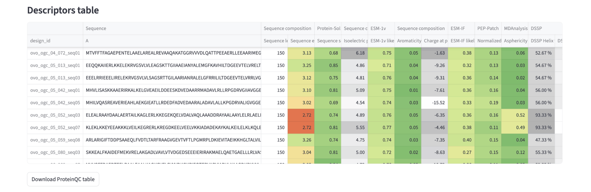
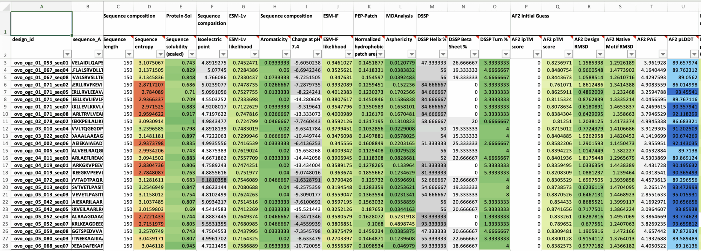
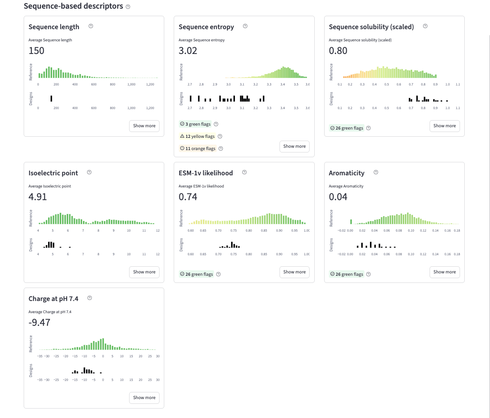
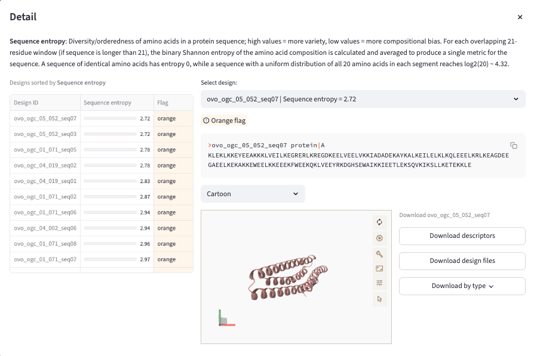
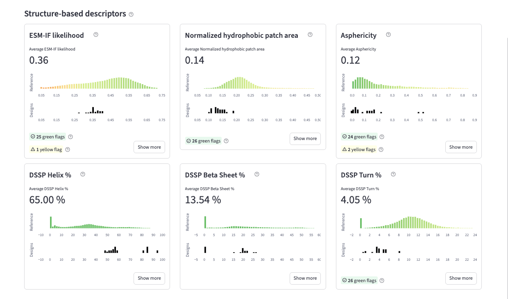
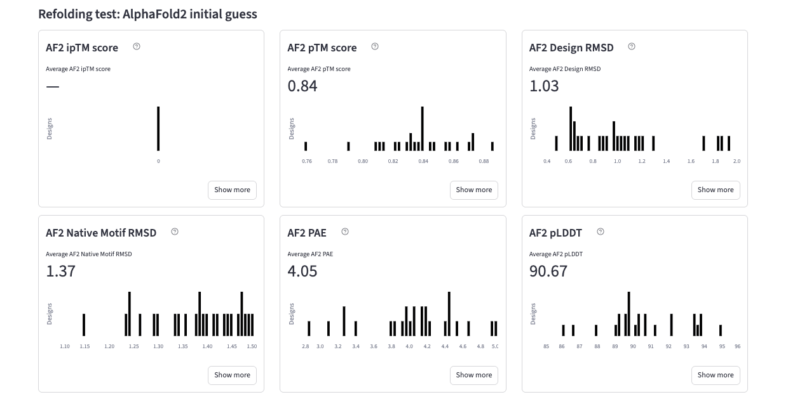
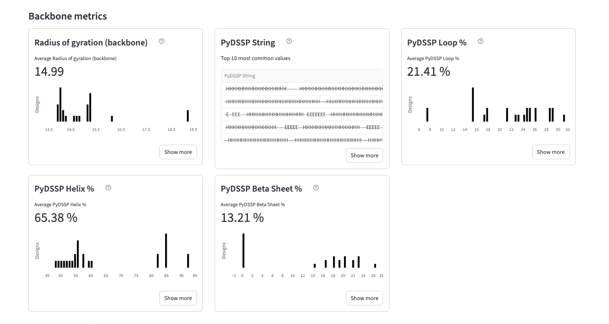
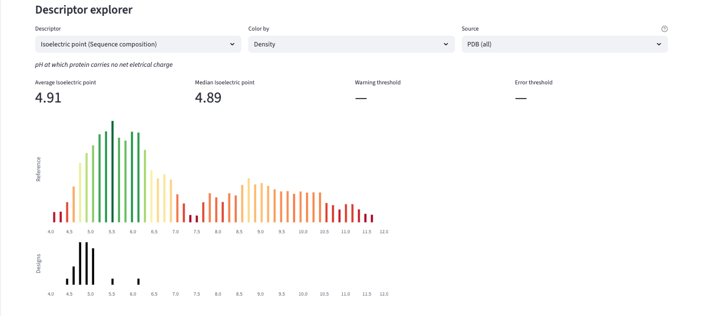

# ProteinQC Walkthrough
Once your ProteinQC job has finished, the ProteinQC view will be populated. You will be able to explore descriptors of your designs or uploaded structures and compare them to distributions of descriptors computed from the PDB database.

## 1. Descriptors table
The overview table displays the main ProteinQC descriptors for all your designs. If you hover over any column name, you can read a detailed description of that descriptor. The table uses a color scheme to help you quickly identify potential issues. 
- Some descriptors like pLDDT and PAE have custom color schemes applied.
- When all thresholds (min, max, warning, error) are set, the colors transition from red to green, with red indicating problematic values and green indicating favorable ones. 
- If thresholds are not fully set but a comparison type is defined (i.e. whether higher values or lower values are favorable), a two-color scale is used where greener values are better.
- If neither thresholds nor comparison types are defined, a neutral grayscale colormap is applied, where darker shades represent higher values. 

You can download this table as an Excel file for downstream filtering and analysis.

## 2. Sequence-based descriptors
The main sequence-based descriptors are displayed as interactive tiles for easy exploration. Each tile shows the descriptor name, its description, the average value across your designs, and a comparison of the distribution between the reference PDB database (top) and your designs (bottom). For some descriptors, the distribution is gradient-colored from red to green, and you can see the number of designs flagged as green (good), yellow (warning), or orange (error). The displayed sequence-based descriptors include sequence length, sequence entropy, predicted solubility, isoelectric point, ESM-1v likelihood, aromaticity, and charge at pH 7.4.

You can browse individual designs and examine their specific descriptor values by clicking "Show more" on any tile.

## 3. Structure-based descriptors
Structure-based descriptors are displayed in the same tile format as sequence-based descriptors, making it easy to compare your designs against PDB reference distributions. The main structure-based descriptors include ESM-IF likelihood, normalized hydrophobic patch area, asphericity, and DSSP-computed secondary structure percentages (helix, beta sheet, and turn content). As with sequence-based descriptors, you can click "Show more" on any tile to browse individual designs and examine their structural properties in detail.

## 4. Refolding test descriptors
If you have OVO-generated designs or have performed refolding analysis in the "🔁 Refolding" page for uploaded structures, you can also explore the resulting refolding descriptors. These metrics, which assess how well designs maintain their intended structure when predicted by AlphaFold2, are displayed in the same tile format as other descriptor categories but there is no reference distribution.

## 5. Backbone metrics
For OVO-generated designs, additional backbone metrics tiles are available, providing insights into the quality and characteristics of the designed protein backbones before sequence design.

## 6. Descriptor explorer
The Descriptor Explorer provides flexible, interactive analysis of any descriptor in your dataset. Select any descriptor from the dropdown menu to visualize its distribution. You can choose how to color the reference distribution from three options: by density (showing where most PDB structures fall), by thresholds (highlighting warning and error regions), or with no coloring for a neutral view. The reference distribution selector allows you to compare against different PDB subsets based on structure source and sequence length. Structure source options include human only, non-human only, and mixed human plus non-human (such as human targets with non-human antibodies). Length categories include short (≤100 residues), medium (101-300), long (301-1000), and very long (>1000 residues). For each descriptor, you will see the average value across your designs, the median value, and any warning or error thresholds that have been configured. This comprehensive view helps you understand how your designs compare to natural proteins and identify any potential outliers.

