# RFdiffusion binder design step by step

This workflow enables designing new binders to your input structure. It implements and extends the end-to-end workflow for binder design from [RFdiffusion](https://github.com/RosettaCommons/RFdiffusion).
            
Use case: designing linear peptide or miniprotein binders to a desired site on a target protein.
      
## 1. Prerequisites

Before you proceed, make sure to install OVO by following [OVO Installation](../user_guide/installation.md)
and set up RFdiffusion as described in [RFdiffusion Quickstart](quickstart.md).

## 2. Input structure
Begin by providing the target structure you want to design a binder for. You can either enter a PDB ID or upload your own PDB file.

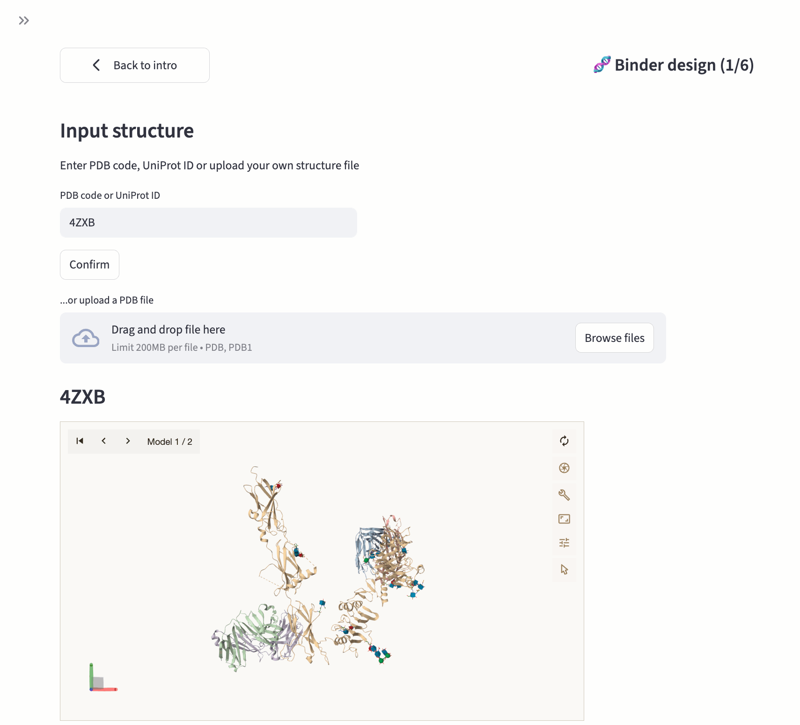

**Example: Insulin receptor binder (PDB id: 4ZXB)**
In this tutorial, we'll design a binder to the insulin receptor using PDB ID 4ZXB, which contains the structure of the human insulin receptor ectodomain (IRDeltabeta construct) in complex with four Fab molecules. Simply enter "4ZXB" in the PDB ID field to load this structure.

## 3. Select binding hotspots
After loading your target structure, choose the desired binding site by selecting "hotspot" residues on your target protein. You can select these residues directly in the sequence viewer or by clicking on them in the 3D structure. If you prefer, you can leave this blank to allow binding anywhere on the target's surface.

To help you identify and select appropriate hotspots, the interface provides several visualization options. You can display glycosylation sites, choose different molecular representations (cartoon or surface), and apply various coloring schemes (hydrophobicity) to better understand your target structure.

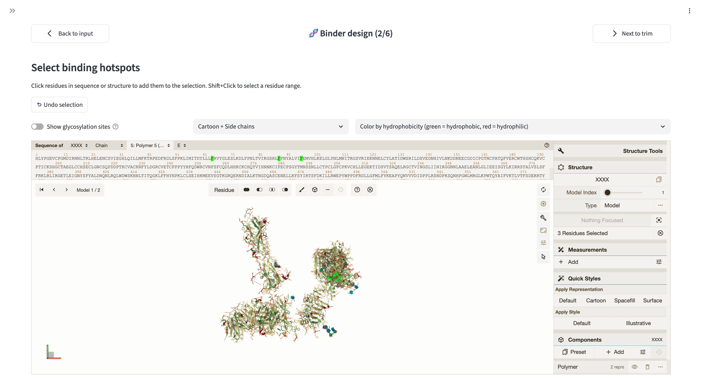

**Example: Insulin receptor binder (PDB id: 4ZXB)**
For targeting the insulin binding site on the receptor, first select chain E (the insulin receptor chain) using the chain selector in the Mol* structure viewer's top bar. Then specify three key hotspot residues: 64, 88, and 96. 

## 4. Target chain trimming
To optimize computational efficiency and avoid running out of GPU memory, you should trim your target chain to include only the relevant regions. Since runtime scales quadratically (or worse) with the number of residues, reducing the structure to the essential areas (such as regions around your specified hotspots) will significantly speed up the design process. You will see how the trimmed structure looks like and you can display it as a surface colored by hydrophobicity.

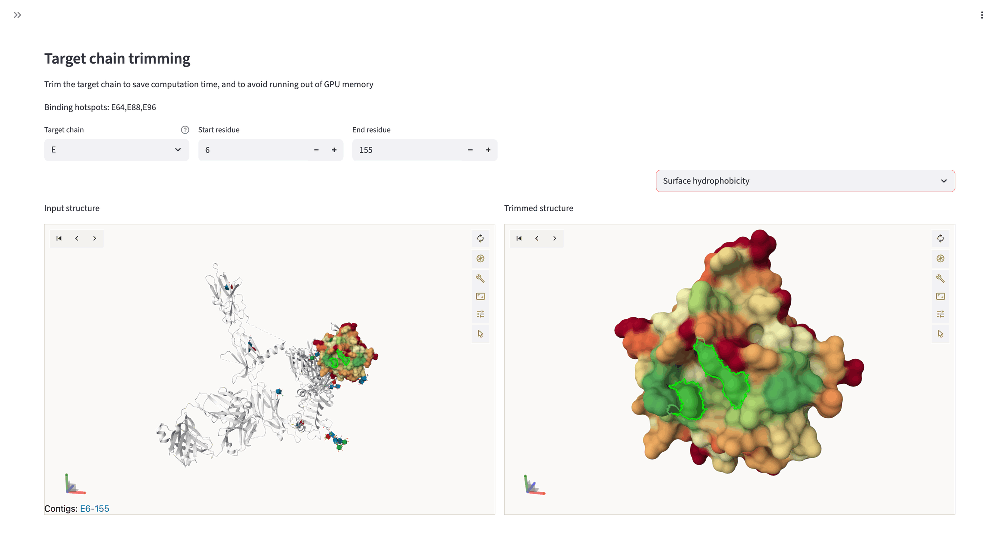

**Example: Insulin receptor binder (PDB id: 4ZXB)**
Since the 4ZXB structure is a large multi-chain complex, trimming is essential for computational efficiency. Select chain E (insulin receptor) as your target chain, then trim it to the L1 domain by setting the start residue to 6 and the end residue to 155.

## 5. Enter binder settings and preview design
Now you'll set the parameters for your desired binder. Specify the binder length, which can be either a single value or a range. If needed, you can refine your hotspot residue selection at this stage.

Before running the full design workflow, you can optionally generate a quick preview using a reduced number of RFdiffusion iterations (15 instead of 50) to verify your settings. This preview typically takes 2-10 minutes depending on the length of your target and binder. You can iteratively adjust the parameters until you're satisfied with the preview results.

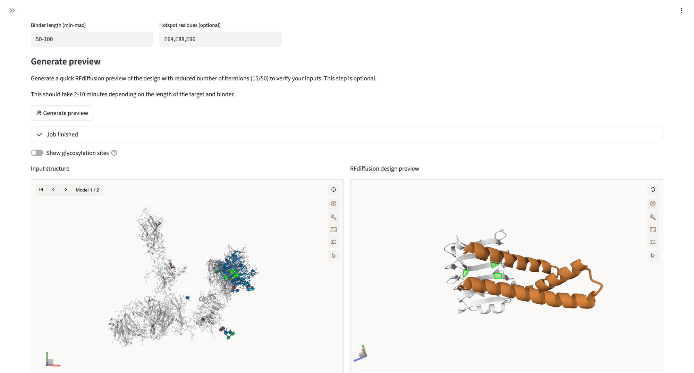

**Example: Insulin receptor binder (PDB id: 4ZXB)**
For this insulin receptor binder, set the length range to 50-100 residues. After generating the preview, examine the resulting structure carefully. As shown in the image above, the preview binder is mostly helical and makes contacts with the target around your specified hotspot residues.

## 6. Settings
Select or create a project round to organize your designs, then give your pool of designs a descriptive name. You can optionally add a detailed description to help document your design goals.

The RFdiffusion contig is automatically generated based on your previous selections, but you can manually adjust it if needed. You can also modify the hotspot residues at this stage.

Choose between the `Complex_base` or `Complex_beta` model weights. While the base RFdiffusion model tends to generate mostly helical binders, the beta model provides greater diversity of topologies.

Specify the number of RFdiffusion backbones to generate. The system allows up to 1000 or 5000 designs depending on your user permissions, though it's recommended to start with 100-200 backbones to verify your settings before scaling up.

Set the number of FastRelax iterations, with each iteration producing an additional sequence beyond the initial ProteinMPNN design.

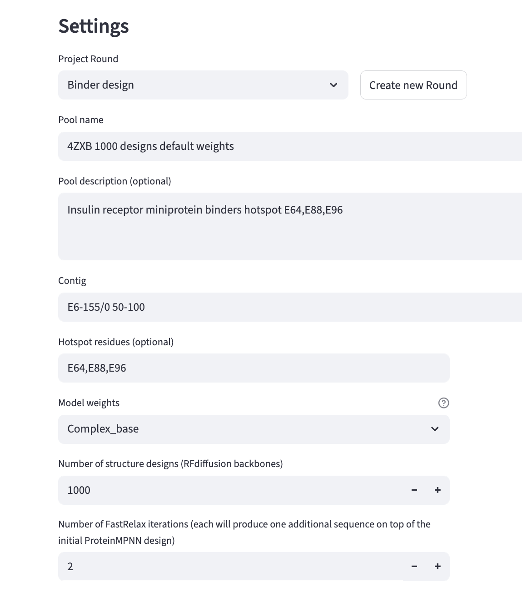

**Example: Insulin receptor binder (PDB id: 4ZXB)**
Create a new round called "Binder design" to organize this design campaign. The contig string `E6-155/0 50-100` was automatically generated, it instructs RFdiffusion to design a binder of `50-100` residues targeting chain E residues `6-155`. The hotspot field should be pre-filled with `E64,E88,E96` from your earlier selections.

Tip: To explore structural diversity, consider submitting two runs: one with `Complex_base` weights (which typically generates helical binders) and another with `Complex_beta` weights. For the second run, you can prefill all fields by selecting the first run in `Re-use previous run` and then just change the weights field in Settings.

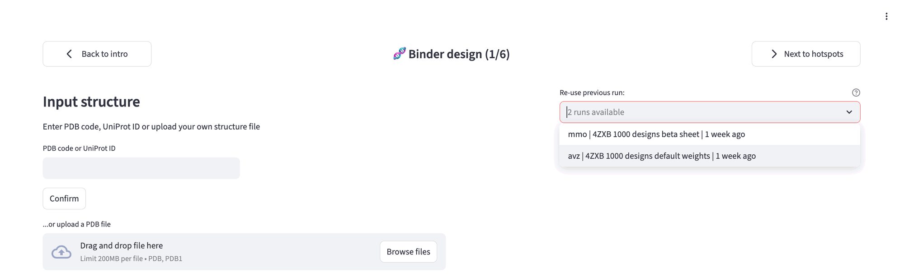

### Advanced settings
You can customize additional advanced settings to optimize your workflow. You can set hard filters for backbone designs that will be applied before sequence design. This allows you to avoid the computational cost of designing sequences for structures that don't meet your basic requirements, such as specific secondary structure content or minimum contact numbers.

Expert users have the option to pass supplementary arguments to RFdiffusion for greater flexibility.

For ProteinMPNN sequence design, you can adjust the sampling temperature, specify residues to omit from design, or set amino acid biases to increase or decrease the probability of sampling specific amino acids.

You can configure the parameters for refolding tests. Note that you can also submit refolding jobs with different parameters later from the "🐣 Designs" page.

Finally, set acceptance thresholds for your designs, including AlphaFold2 Binder RMSD, PyRosetta ddG, and AlphaFold2 iPAE values. These thresholds can be adjusted later if needed in the "⏳ Jobs" page.

## 7. Review and submission
Review all your settings carefully before submission. Once you're satisfied, select your scheduler and click submit. You'll be automatically redirected to the "⏳ Jobs" page to monitor your run.

## 8. Jobs
The "⏳ Jobs" page displays all your submissions for the current project. Once the workflow completes, all designs are saved to OVO storage and registered in the OVO database. 

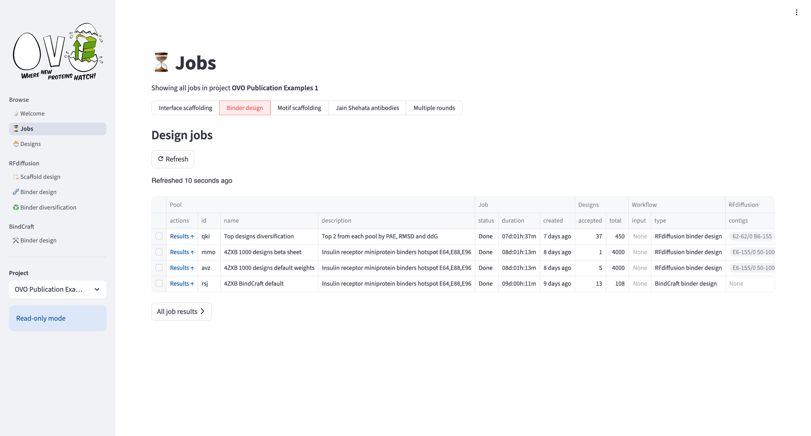

Click on the Result link for a specific pool or select "All job results" to view all pools together.
The page provides two views: Accepted designs and All designs.

### Accepted Designs
This view shows the number of designs passing your current acceptance thresholds. You can enable or disable individual criteria and adjust threshold values as needed. Once you're satisfied with the selection, confirm the thresholds to mark the designs as accepted.

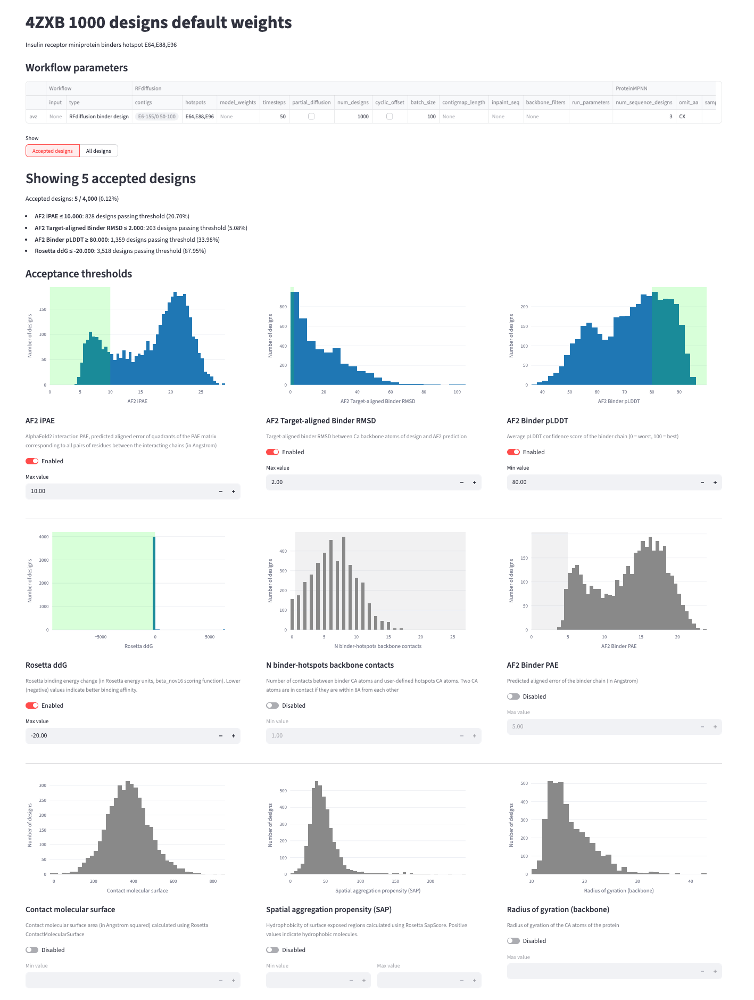

**Example: Insulin receptor binder (PDB id: 4ZXB)**
For the insulin receptor binder, you can see from the screenshots above that the acceptance thresholds are set as: 
- AF2 iPAE ≤ 10
- AF2 Target-aligned Binder RMSD ≤ 2
- AF2 Binder pLDDT ≥ 80
- Rosetta ddG ≤ -20

In this example, out of 4,000 total designs generated, only 5 designs pass all thresholds.

---
Below the threshold controls, you can download descriptor tables, design files, and other data. You can also browse individual designs to explore their metrics, structure visualizations, and sequences.

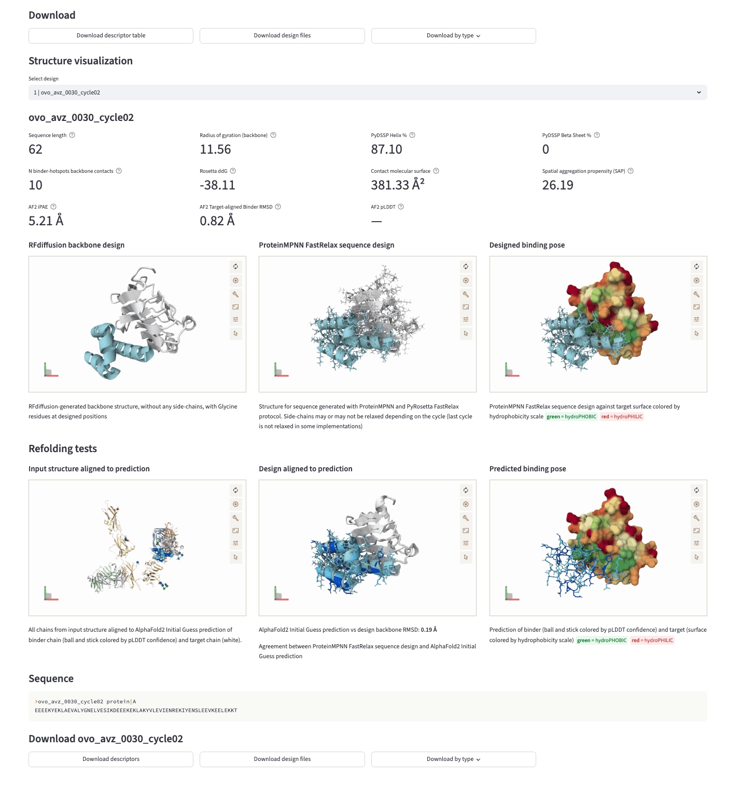

### All designs
This view features an interactive scatter plot where you can explore all your designs by hovering over points to see more information. You can change the axes to examine different descriptors and draw selection boxes to filter designs within specific parameter ranges. The accepted designs are highlighted for easy identification.

The filtered designs appear below the plot, where you can again download corresponding descriptor tables, design files, and browse individual designs with their metrics and visualizations.

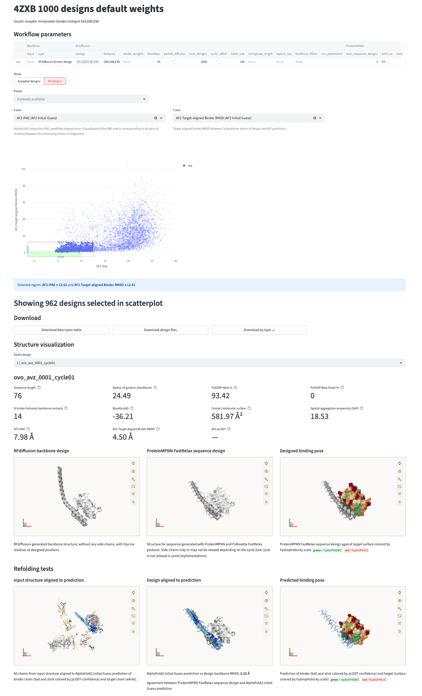

## 9. Designs
The accepted designs (typically only 0.1% to 1% of all generated designs in RFdiffusion workflows) can be further analyzed in the "🐣 Designs" page. For example, you can run ProteinQC to compute additional descriptors such as predicted solubility, electrostatic properties, hydrophobic patch area, and more.

### Example: Insulin receptor binder (PDB id: 4ZXB)
For the insulin receptor example, you can explore different views of the accepted designs in the "🐣 Designs" page.

#### Explorer
In the explorer view, you can compare various descriptors in the scatterplot and browse the designs, look at their metrics, structures and refolding tests results.

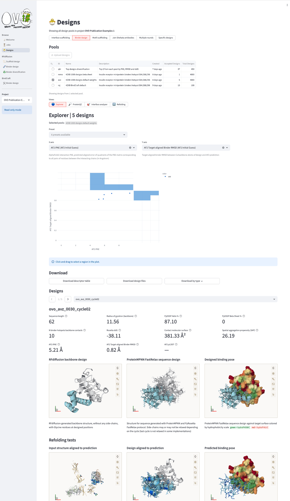

#### ProteinQC
The ProteinQC analysis computes additional sequence and structure descriptors and compares them to PDB reference distributions to identify potential outliers.

Learn more in [ProteinQC Quickstart](../proteinqc/quickstart.md).

In the insulin receptor binders example all designs show favorable predicted solubility scores, on the other hand, the analysis showed that all five designs exhibit low sequence entropy compared to natural proteins.

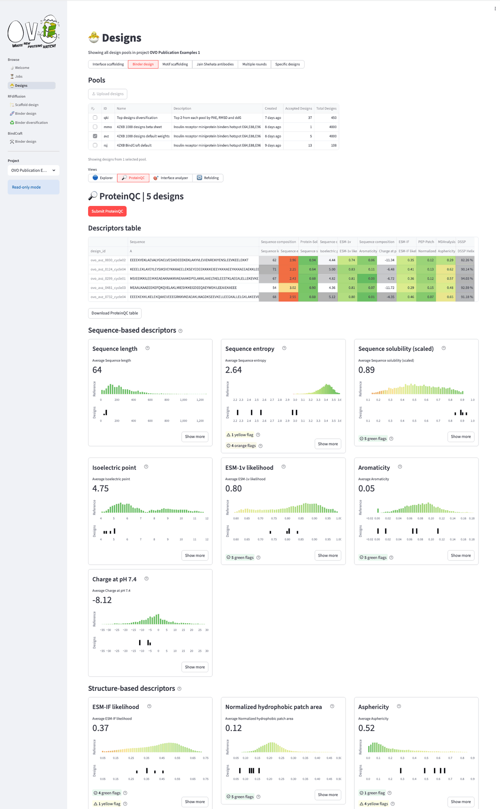

You can browse individual designs by clicking "Show more".

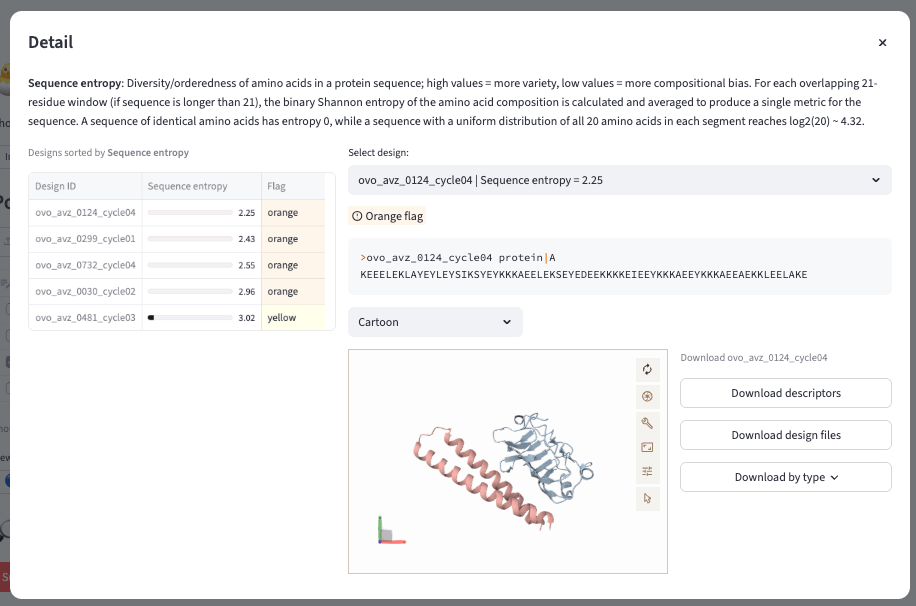

#### Interface analyzer
In the Interface analyzer, we can explore in more details which target residues are in contact with the binder backbone.

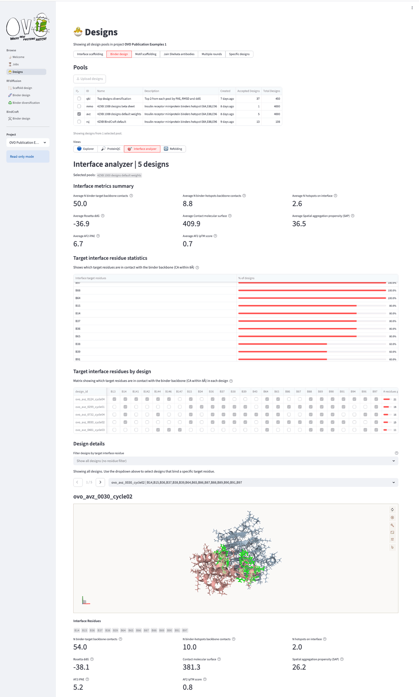

---

Next: [RFdiffusion Binder Diversification](binder_diversification.md) or [ProteinQC Quickstart](../proteinqc/quickstart.md)