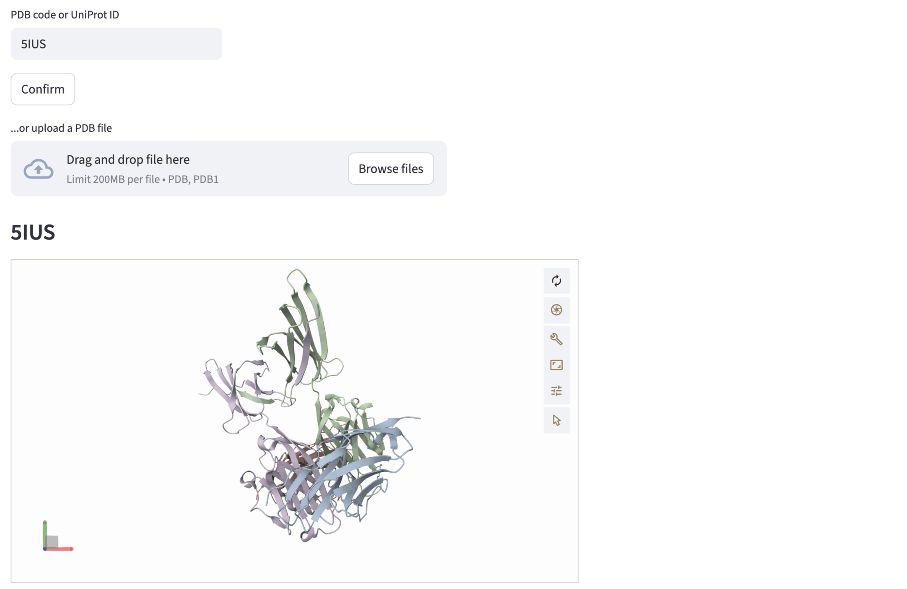
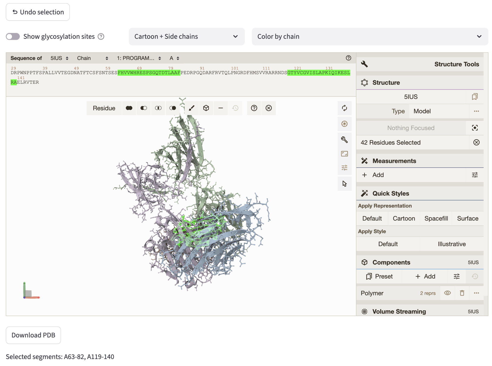
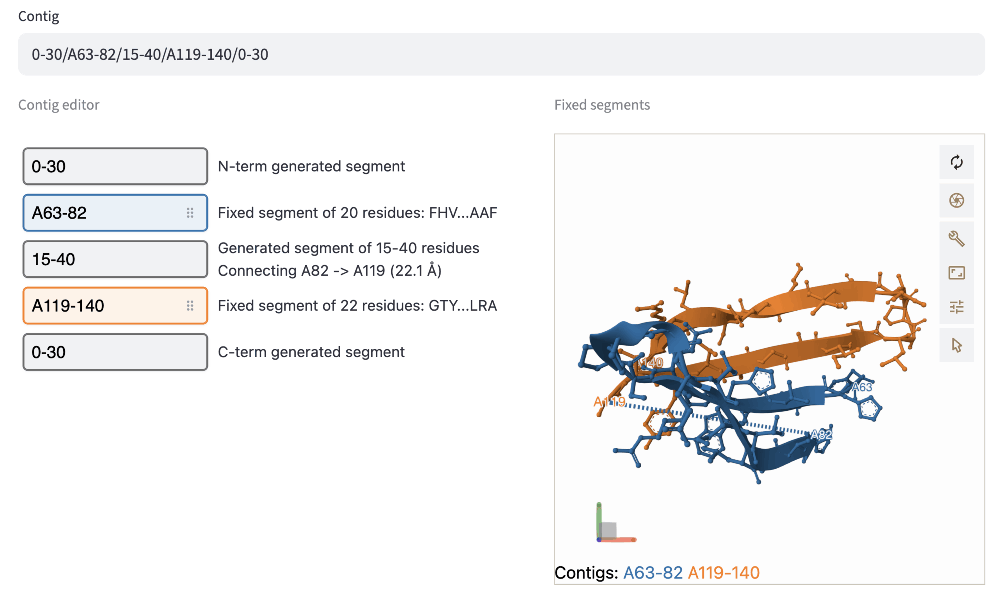
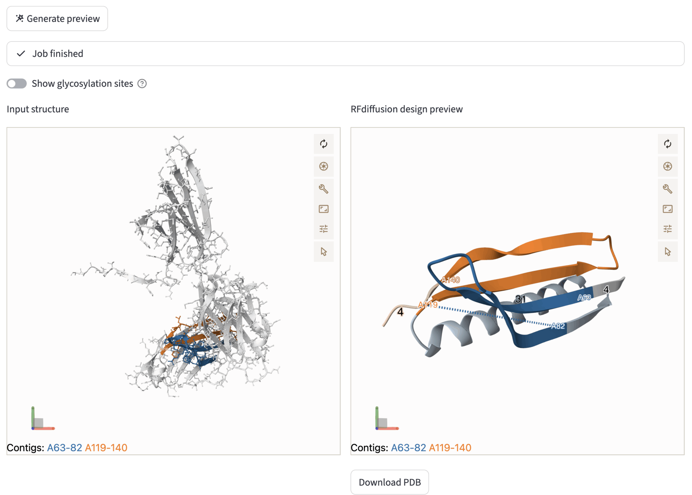
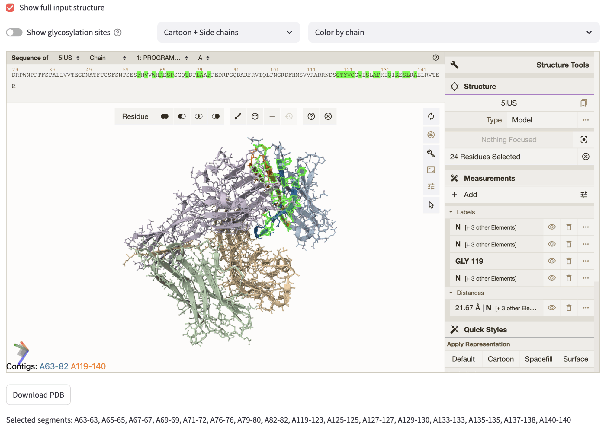
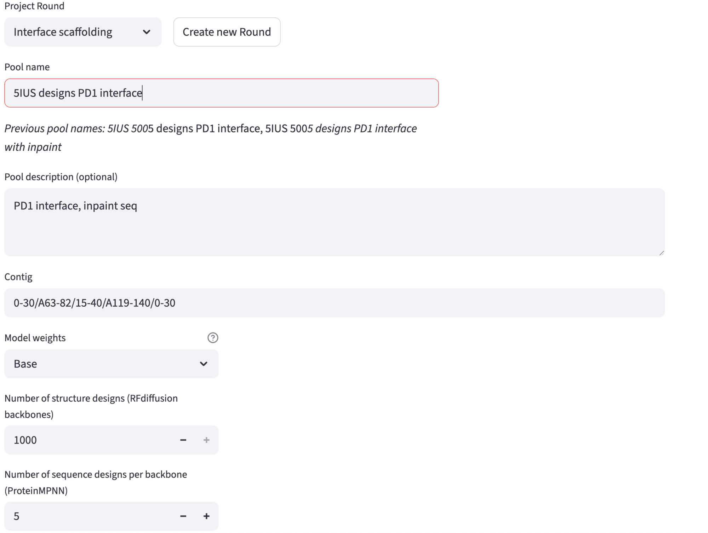
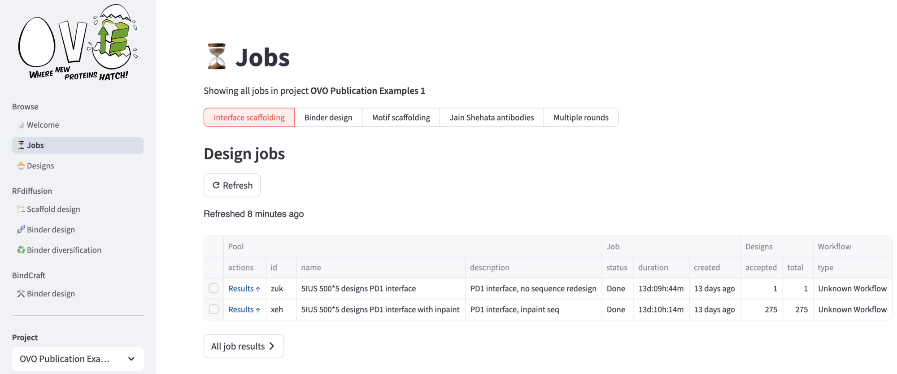
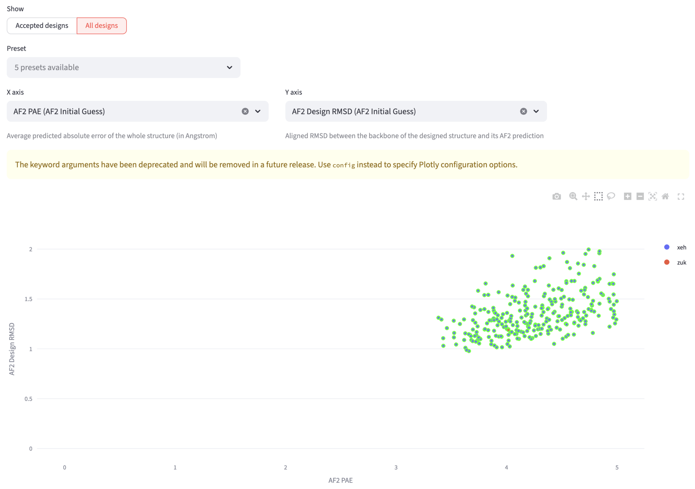
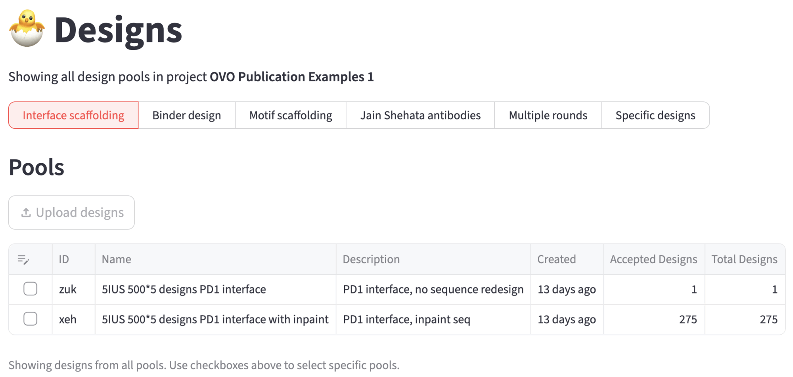
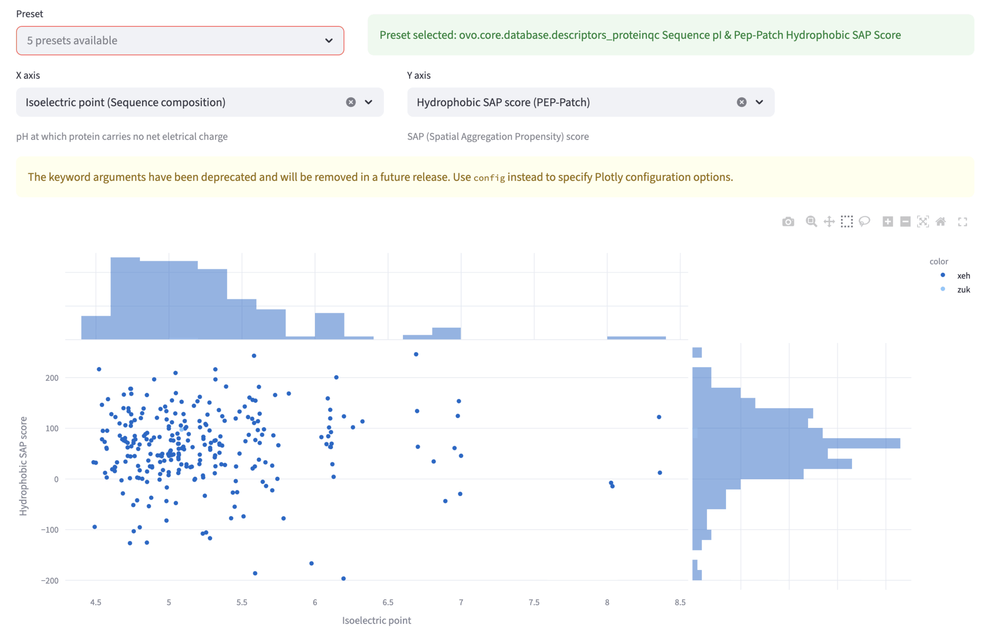

# RFdiffusion scaffold design step by step

This workflow enables designing a new protein structure that supports fixed segments (*motifs*) from an existing structure. 
It implements and extends the end-to-end workflow for motif scaffolding from [RFdiffusion](https://github.com/RosettaCommons/RFdiffusion).

Possible use cases include:

- Scaffolding a new enzyme around a defined active-site geometry
- Truncating a region of a protein formed from multiple discontinuous regions of the sequence
- Designing a new scaffold that stabilizes that fixed region and enhances solubility (e.g. by removing an unwanted hydrophobic interface)

## 1. Prerequisites

Before you proceed, make sure to install OVO by following [OVO Installation](../user_guide/installation.md)
and set up RFdiffusion as described in [RFdiffusion Quickstart](quickstart.md).

## 2. Input structure

You can input a PDB structure by:
- uploading a structure file.
- entering a PDB code or a UniProt ID and hitting the `confirm` button.
- loading a previous run from the history dropdown using `Re-use previous run` in the top right corner.

An interactive Mol* visualization will appear. If a previous run is selected, the following steps input will be auto-populated. To proceed, hit the `Next to selection` navigation button.

**Example: PD-1 interface scaffolding (PDB id: 5IUS)**

In this example, we input the PDB code correspondent to the PD-1 structure, 5IUS. Then, the structure is rendered in the Mol* viewer. Different chains are represented with different colors.

## 3. Select residues to keep 

You can select residues both in the sequence and in the structure of the Mol* viewer. Their position will be kept *approximately* fixed during the scaffolding -- RFDiffusion can modify the geometry of the selected residues for very small motifs during the de-noising process; this can be adjusted by selecting the *ActiveSite* weights in the `6. Submission` section.
You can select different graphic representations: `Cartoon`, secondary-structure ribbon/tube representation (only backbone); `Cartoon + Side chains`, backbone ribbon/tube representation together with sticks-and-ball representation for side chain atoms and bonds; `Molecular Surface` for molecular/solvent-accessible surface representation. 

All representations can be colored by chain or by hydrophobicity (green = hydrophobic, red = hydrophilic).

The `Show glycosylation sites` detects possible glycosylations by recognising the following pattern in the sequence triplets: ("ASN", "ALL except PRO", ["THR", "SER"]). They are visualized as "cubes" in the structure, if the toggle is activated.

The `Undo Selection` button allows to undo the current selection, and the structure can be downloaded through the `Download PDB` button. The selected residues are highlighted in both the structure and the sequence. Selected segments are reported at the bottom of the tab, and used as input for the following step, which can be accessed by hitting `Next to contig`.

**Example: PD-1 interface scaffolding (PDB id: 5IUS)**

After choosing the structure, we aim to preserve the PD-1 interface to allow conditional generation of the new scaffold. Therefore, in the selection step, we select the segments `119-140` and `63-82` of chain A.
The selected segments are highlighted simultaneously on the Mol* structure representation and on the Mol* sequence panel (by default showing chain A - use the dropdowns at the top of the viewer to select a different chain).

## 4. Enter contig and generate preview 

The contig defines which parts of the structure will be preserved, in which order they will be connected, and how many residues will be designed in between. If segments are selected in the previous step, the `Contig` input field is auto-populated; since only fixed residues are specified, the contig will look like A12-34/A56-78/B1-9. This value specifies that in the designed structure, the following segments are kept: Residues `12-34`, `56-78` of chain A, and residues `1-9` of chain B. 

Input contig can be modified in two ways:
- by modifying the contig value directly in the `Contig` input field;
- using the `Contig editor`. 

In the contig editor you can modify the previously selected fixed segments (represented by colored boxes). Furthermore, you can specify the length (or the range of length) of the designed segments: add N-term, C-term, and connecting segments by pushing the `+` button in between fixed segment widgets, and filling the grey box with the desired length value. Moreover, you can re-order the fixed segments by simply *drag-and-dropping* the boxes, to explore multiple permutations of the fixed segments and diversifying the designed connections. A ball-and-stick representation of the fixed segments serves to visualize the structure of the selected segments: fixed segments are colored as in the contig editor, and fixed contigs are annotated at the bottom-left of the viewer.

In the *Generate preview* subsection, you can try the backbone design process by selecting the number of RFDiffusion de-noising steps -- the smaller the number of steps, the faster is the preview -- and hitting the `Generate preview` button. This action will trigger the RFdiffusion workflow. During the process, job can be tracked using the provided log, or also aborted by hitting the `Abort` button at the bottom-left of the expander window. The job will run asynchronously, so that the user can navigate the application without terminating the preview job. When the job has finished, comparative viewers will be displayed, with the input structure (ball-and-sticks) on the left, and the RFdiffusion design preview on the right. The designed preview can be downloaded through the `Download PDB` button.
The comparative viewer allows the user to inspect the possible designs of RFdiffusion, by exploring different contig configuration and visualizing the impact on the outcome structure. After this step, you can proceed to the next step through `Next to sequence inpainting`.

**Example: PD-1 interface scaffolding (PDB id: 5IUS)**

In this step, we show the selection of the length ranges for the designed segments. 

After generating the preview, the viewers show the original input structure on the left, and the generated design preview on the right.

## 5. Sequence inpainting (optional)

In this step, you will be able to optionally select input structure residues that will be kept in the structure but redesigned with ProteinMPNN. By default, ProteinMPNN generates the sequence only for the structurally re-designed segments, but it can be useful to re-design the *sequence* of the fixed segments in the new scaffold.

The interface shows similar options to the `Select residues to keep` section, showing by default only then fixed segments selected in the previous steps. By checking the checkbox `Show full input structure`, you can visualize the full input structure. Akin to previous steps, residues for inpainting can be selected both from sequence and structure, and they will be highlighted automatically. The inpainted sequence is then used an advanced option of the next step. After the selection, you can proceed to the settings page, through `Next to settings`.

**Example: PD-1 interface scaffolding (PDB id: 5IUS)**

In the figure, we show the selection we used to inpaint part of the fixed motif selected in the segment selection step. The rationale behind this selection is to let ProteinMPNN re-design also the residues whose side-chains are not facing the binder interface -- note that most of the selected side-chains are facing inward. Instead, the other residue side-chains are directed towards the binding interface, as you can notice by showing the full input structure.

## 6. Settings

In this section, you can input all the relevant parameters to run the end-to-end RFdiffusion pipeline, that contains the RFdiffusion for backbone generation, LigandMPNN with ProteinMPNN weights for sequence generation and refolding test workflows. 

First, you can select a Round. Within a project, this will help you rationalize the progressive design effort by specifying at which round of de-novo design you are at (it might be first exploration, full run generation, or further refining/diversification). By default, rounds are pre-filled and numbered (Round 1, Round 2, etc.), but you can customize your round name when creating it. 

Then, you can choose the pool name and description. The other required fields are pre-filled. Model weights are set by default to `Base`; `ActiveSite` weights allow for better fixed geometry in case of small motif scaffolding. Then, you can change the desired number of structure designs -- up to few hundreds for exploratory purposes, more than 1000 for full run generation. The number of sequences generated per backbone can also be changed, typically 5-10.

The advanced settings include a series of user-friendly widgets to input different advanced options for RFdiffusion, LigandMPNN and Refolding tests. Several types of settings for refolding tests are allowed, such as AF2 Monomer, AF2 Multimer and ESMFold. Importantly, acceptance thresholds can be set in the advanced options panel to filter the designs. These filters will be automatically applied to mark the resulting designs as accepted or rejected. Note that the acceptance criteria can be changed when the design run has finished.

**Example: PD-1 interface scaffolding (PDB id: 5IUS)**

Here we show the settings used for the example run in the demo app. 

Advanced options are listed in the expander. For this particular showcase, we have set:
- RFdiffusion: 50 denoising steps, maximum sequence length of 100, and `A63/A65/A67/A69/A71-72/A76/A79-80/A82/A119-123/A125/A127/A129-130/A133/A135/A137-138/A140` inpainting contig;
- ProteinMPNN: MPNN sampling temperature set to 0.1, and excluding cysteines and unknown (C and X, respectively);
- Refolding tests: AF2 monomer with 3 recycles;
- Acceptance thresholds: AF2 PAE (smaller than 5.0), AF2 Design RMSD up to (smaller than 2.0), AF2 Native Motif RMSD up to (smaller than 2.0), AF2 pLDDT (larger than 80).

## 7. Review settings

In the last section, you can review the selected options for the end-to-end RFdiffusion scaffold pipeline. This step is in particular important to further check the input of the pipeline, mostly to avoid waste of computational resources and time.

## 8. Jobs

After submitting the run, you will be redirected to the `⏳ Jobs` page, that displays all your submission for the current project. In the top menu, you can select among different single rounds, or by clicking `Multiple rounds` you can choose a custom multiple rounds at once. A `Refresh` button can be hit to update the `status` of a job -- "Queue" if the job is awaiting, "Running" if the Nextflow workflow is running, "Done" if the job is terminated successfully, "Error" otherwise. Other jobs information are stored into the table.

The `All jobs` buttons leads to the first exploration of designs. In the segmented option you can select either `All designs` or `Accepted designs`. If you select `All designs`, you can visualize a scatterplot to explore various design metrics (such as RMSD, pLDDT, or other descriptors) for all generated designs.

### Accepted Designs
This view shows the number of designs passing your current acceptance thresholds. You can enable or disable individual criteria and adjust threshold values as needed. Once you're satisfied with the selection, confirm the thresholds to mark the designs as accepted (for further information, see Binder design documentation).

### All designs
This view features an interactive scatter plot where you can explore all your designs by hovering over points to see more information. You can change the axes to examine different descriptors and draw selection boxes to filter designs within specific parameter ranges. The accepted designs are highlighted for easy identification.

The filtered designs appear below the plot, where you can again download corresponding descriptor tables, design files, and browse individual designs with their metrics and visualizations.

## 9. Designs
The accepted designs can be further analyzed in the `🐣 Designs` page. For example, you can run ProteinQC to compute additional descriptors such as predicted solubility, electrostatic properties, hydrophobic patch area, and more.

#### Explorer
In the explorer view, you can compare various descriptors in the scatterplot and browse the designs, look at their metrics, structures and refolding tests results. The `Preset` dropdown allows to select different preset comparisons. Other two dropdowns `X axis` and `Y axis` permit independent selection of the two quantities plotted in the scatterplot. The plot features also the marginal distributions. You can "click and drag" to select a region in the plot; the selected designs will be shown in the next subsection, for closer inspections of single designs.

**Example: PD-1 interface scaffolding (PDB id: 5IUS)**

In this example, we show the Hydrophobicity SAP score and the Isoelectric point for the 276 accepted designs. 

#### ProteinQC

The ProteinQC analysis computes additional sequence and structure descriptors and compares them to PDB reference distributions to identify potential outliers (Learn more in [ProteinQC Quickstart](../proteinqc/quickstart.md)).
See Binder design documentation for more info.

#### Interface analyzer

In the Interface analyzer, we can explore in more details which target residues are in contact with the binder backbone.
See Binder design documentation for more info.

---

Next: [RFdiffusion Binder Design](binder_design.md)
